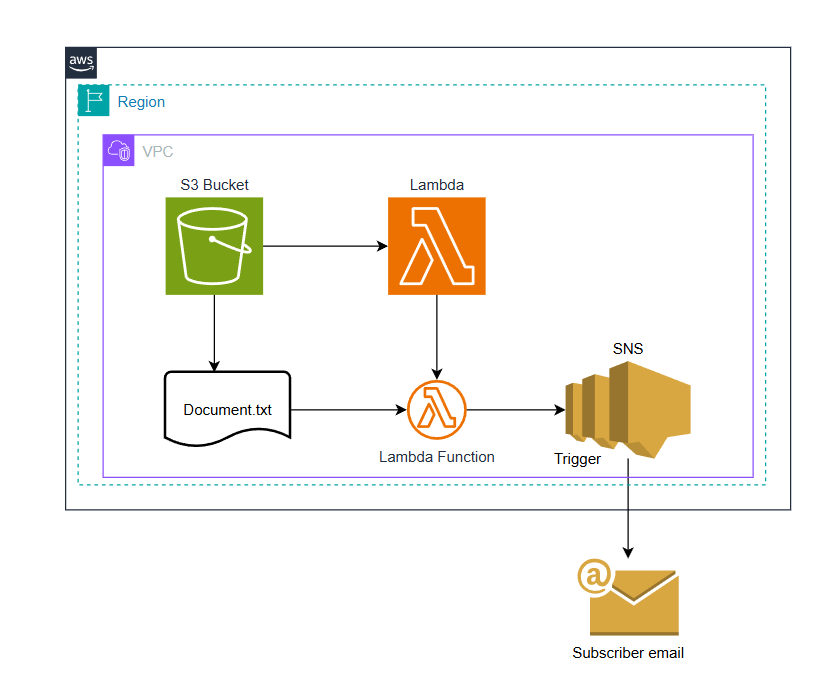

# Word Counter Lambda with S3 and SNS

This project implements an AWS Lambda function in Python that counts the number of words in a text file uploaded to an S3 bucket. After counting, it publishes the word count to an SNS topic, which sends an email notification.

## Architecture

1. **S3 Bucket** – Stores uploaded text files.
2. **Lambda Function** – Triggered by S3 object creation, counts words, and publishes to SNS.
3. **SNS Topic** – Receives the word count and sends an email.

## Files

- `lambda_function.py`: The Lambda handler code.
- `requirements.txt`: Lists Python dependencies (if any).
- `event.json`: Example S3 event for local testing.

## Prerequisites

- An AWS account
- IAM role with permissions for Lambda, S3, and SNS
- Verified email address for SNS notifications

## Setup

1. Login to AWS Console.  
2. Select the Lambda service in the AWS Management Console.  
3. Create a new Lambda function.  
4. **Install dependencies**  
    If using external libraries, add them to `requirements.txt`.
5. **Deploy Lambda**  
    - Zip your code and dependencies.
    - Upload to AWS Lambda.
    - Set the S3 trigger and provide the SNS topic ARN via environment variables or directly in the code.
6. **Configure S3 and SNS**  
    - Create an S3 bucket and SNS topic.
    - Subscribe your email to the SNS topic.
    - Grant Lambda permissions to access S3 and SNS.

