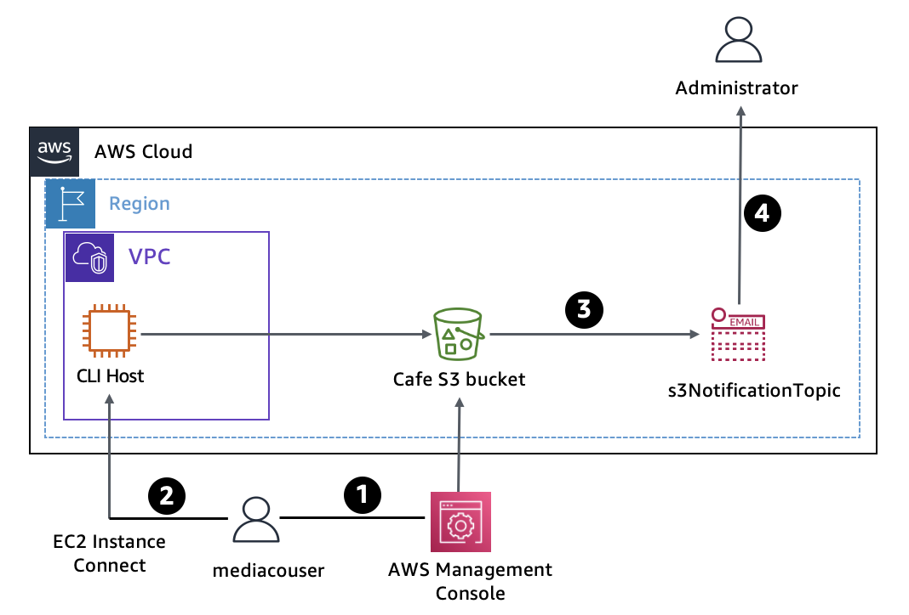
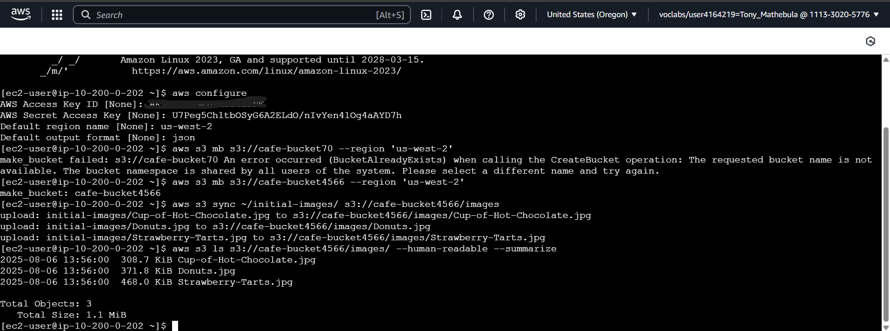
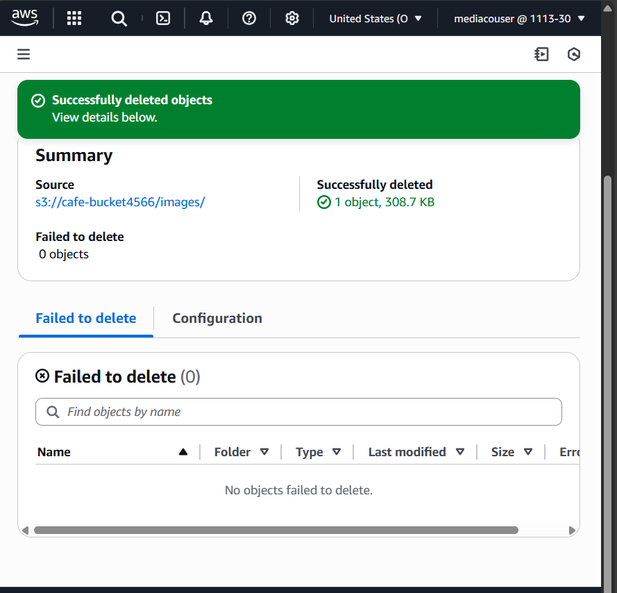

# AWS S3 Media Upload Workflow

This project demonstrates a secure AWS-based workflow that allows an external user from a media company to manage product images using Amazon S3 and receive change notifications via Amazon SNS.

## Scenario Overview

An external IAM user named `mediacouser` is granted permission to interact with an Amazon S3 bucket containing product images. The permissions allow the user to:

- Upload new images
- Update existing images
- Delete images

Any change to the bucket triggers an email notification to the system administrator via Amazon SNS.

## Workflow Description

1. **Image Management by External User**  
   A media representative logs into the AWS Management Console using the IAM user `mediacouser`. Alternatively, the user may use the AWS CLI to:
   - Add new product pictures
   - Update existing pictures
   - Delete outdated or incorrect pictures

2. **S3 Bucket Change Detection**  
   Amazon S3 is configured to detect changes in the bucket (PUT, POST, DELETE events). These changes automatically trigger a notification.

3. **SNS Notification**  
   On detecting a change, S3 sends a message to the `s3NotificationTopic` (an Amazon SNS topic).  
   The administrator who is subscribed to this SNS topic receives an **email notification** with details about the changes made.

## Security Considerations

- `mediacouser` IAM permissions are scoped to **only allow access** to specific S3 operations on the designated bucket.
- Regular reviews are conducted to ensure permission policies follow the **principle of least privilege**.
- Although this example grants CLI access to `mediacouser`, in real-world scenarios, such access is usually restricted to further reduce the attack surface.

## Tools & Services Used

- **Amazon S3** – Image storage and event source
- **AWS IAM** – Access management for external user (`mediacouser`)
- **AWS SNS** – Notification system
- **AWS CLI** – Optional command-line access for image management

## Sample AWS CLI Commands (for mediacouser)

```bash
# Upload a new image
aws s3 cp ./new-image.jpg s3://bucket-name/

# Delete an image
aws s3 rm s3://bucket-name/old-image.jpg

# List bucket contents
aws s3 ls s3://bucket-name/
```

 Now let's take a look at my process using AWS CLI to create a bucket and upload some content. Noticed that I got an error when creating the bucket, this happens when you create a bucket name that already exist(bucket names need to be globally unique).
- 
Now this screen is to show that the user has permissions to upload,change or delete contents.
- 
